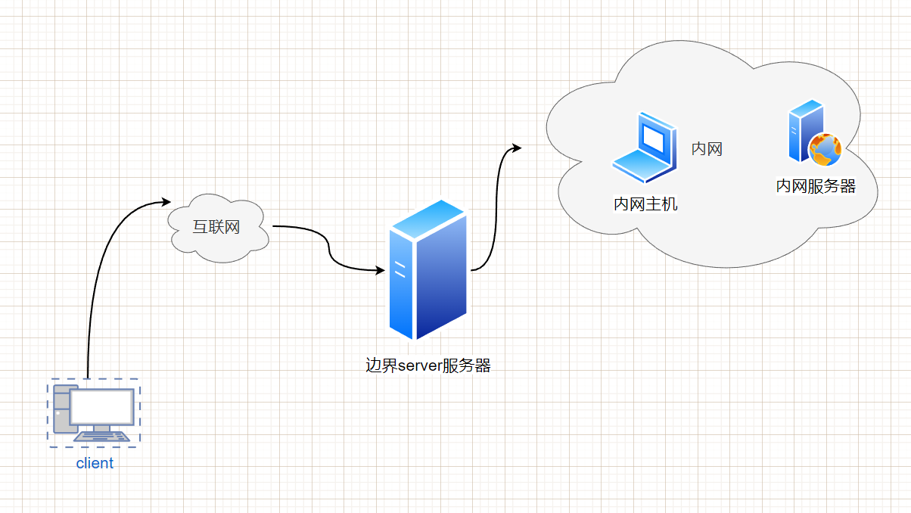
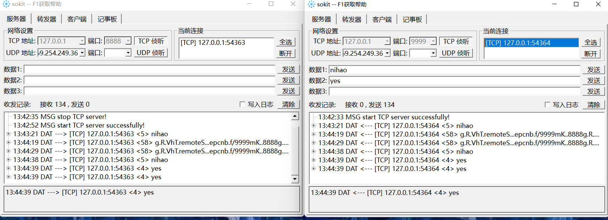
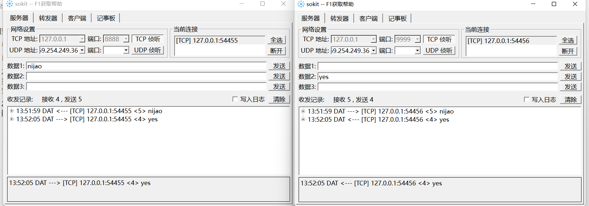
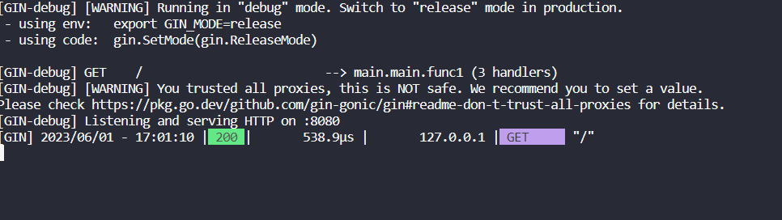
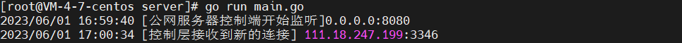
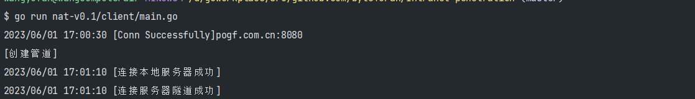

# 内网穿透

## 1. 概念

内网穿透是一种技术，它允许通过公共网络（例如互联网）访问位于私有网络（例如家庭网络或公司网络）中的设备或服务。在传统的网络环境中，私有网络中的设备通常无法直接从公共网络中访问，因为它们位于私有IP地址范围内，并且受到网络地址转换（NAT）和防火墙的限制。内网穿透技术通过各种手段克服这些限制，使得公共网络中的设备可以直接访问私有网络中的设备。

一个通俗的例子是家庭网络中的摄像头访问。假设您在家中安装了一个摄像头，并希望能够通过互联网远程访问它，例如从手机或电脑上查看实时视频。然而，摄像头连接到的是家庭网络中的私有IP地址，而互联网无法直接访问该私有IP地址。这时，您可以使用内网穿透技术，将摄像头的数据流通过公共网络传输到您的手机或电脑上。通过配置适当的内网穿透工具和设置，您可以在不同网络环境中，通过公共网络连接到私有网络中的摄像头，实现远程访问和监控。



接下来我会由GO语言逐渐的开发一个NAT插件

## 2. NAT-v0.1

`NAT-v0.1`版本将会实现一个最基础版的服务。该版本的构思大概是这样的：

1. 首先公网肯定不知道内网在哪里，那么第一步肯定是需要内网客户端告诉公网服务器我在哪
2. 服务器开启一个端口暂时定为`8009`监听用户发来的请求
3. 当`Accept`用户的请求之后，服务器告诉用户：有消息来啦，你需要进行处理
4. 当内网的客户端接收到这个消息后，主动的与服务器的`8008`建立`TCP`连接
5. 此时内网客户端需要同时与本地保留的服务`127.0.0.1:8080`建立连接
6. 连接完成后，服务端需要将`8007`的请求转发到隧道端口的`8008`中
7. 内网客户端从隧道获得用户请求后，转发给内网的服务，同时将内网服务返回的信息放入隧道
8. 之后服务端将隧道中的信息通过`8007`端口返回给用户，一次请求到此结束。

分析上述过程我们并不难发现，其中有两个数据交换的部分：

- WEB服务端层面：用户和隧道
- 内网客户端层面：内网本地服务和隧道

通过这两个过程我们可以很容易的将数据进行交换。

下面我将详细的介绍这些代码：

### 2.1. 封装TCP连接和创建TCP服务的函数

由于这两个函数在我们后面经常会用的到，因此我将这两个函数进行简单的封装：

首先我们先看看要生成一个`tcp`listenner需要什么：

```go
func ListenTCP(network string, laddr *TCPAddr) (*TCPListener, error)
```

参数说明：

- `network` 是网络类型，通常使用 `"tcp"` 表示 TCP 网络。
- `laddr` 是要监听的 TCP 地址，使用 `TCPAddr` 类型表示。它包含 IP 地址和端口号信息。

返回值：

- `*TCPListener` 是一个 TCP 监听器对象，可以通过它来接受传入的 TCP 连接。
- `error` 是可能发生的错误。如果监听器创建成功，该值为 `nil`。

```go
type TCPAddr struct {
	IP   IP
	Port int
	Zone string // IPv6 scoped addressing zone
}
func ResolveTCPAddr(network, address string) (*TCPAddr, error){}
```

参数说明：

- `network` 是网络类型，通常使用 `"tcp"` 表示 TCP 网络。
- `address` 是要解析的 TCP 地址字符串，可以是 IP 地址或域名。

返回值：

- `*TCPAddr` 是一个 TCP 地址结构体，包含解析后的 IP 地址和端口号信息。
- `error` 是可能发生的错误。如果解析成功，该值为 `nil`。

于是我就这样封装：

```go
func CreateTCPListener(addr string) (*net.TCPListener, error) {
	tcpAddr, err := net.ResolveTCPAddr("tcp", addr)
	if err != nil {
		return nil, err
	}
	tcpListener, err := net.ListenTCP("tcp", tcpAddr)
	if err != nil {
		return nil, err
	}
	return tcpListener, nil
}
```

连接`TCP`服务与之类似：

```go
func DialTCP(network string, laddr, raddr *TCPAddr) (*TCPConn, error)
```

参数说明：

- `network` 是网络类型，通常使用 `"tcp"` 表示 TCP 网络。
- `laddr` 是本地地址，表示本机的 IP 地址和端口号。如果不需要指定本地地址，则可以传入 `nil`。
- `raddr` 是远程地址，表示要连接的目标主机的 IP 地址和端口号。

返回值：

- `*TCPConn` 是一个 TCP 连接对象，可以通过它进行读写操作。
- `error` 是可能发生的错误。如果连接成功，该值为 `nil`。

我们将`laddr`变为nil，让系统给他随机分配可用的port

```go
// CreateTCPConn 连接指定的TCP
func CreateTCPConn(addr string) (*net.TCPConn, error) {
	tcpAddr, err := net.ResolveTCPAddr("tcp", addr)
	if err != nil {
		return nil, err
	}
	tcpConn, err := net.DialTCP("tcp", nil, tcpAddr)
	if err != nil {
		return nil, err
	}
	return tcpConn, nil
}
```

### 2.2. 交换连接数据的函数（核心内容）

这一步是整个内网穿透的核心过程，不管以后整个程序写的如何，此处都是十分重要的。这一步呢，我们要封装一个交换数据的函数，即就是，将一个`tcpConn`的数据转发到另一个`tcpConn`里面去，在实现这些内容之前，我们先看看`go`提供的一个函数`io.Copy`:

```go
func Copy(dst Writer, src Reader) (written int64, err error) {
	return copyBuffer(dst, src, nil)
}
```

参数说明：

- `dst` 是目标 `io.Writer` 接口，用于接收拷贝的数据。
- `src` 是源 `io.Reader` 接口，用于提供要拷贝的数据。

返回值：

- `written` 是拷贝的字节数。
- `err` 是可能发生的错误。如果拷贝操作成功，该值为 `nil`。

`io.Copy` 函数会不断地从源 `src` 中读取数据，并将其写入目标 `dst`，直到源 `src` 的数据结束或发生错误。它会自动处理数据的缓冲和复制过程，简化了数据拷贝的操作。

看了这个函数我们是不是一下子就明白了，交换数据是如此的`Easy`!

`TCPConn`这个类型实现了`Write(p []byte) (n int, err error)`和`Read(p []byte) (n int, err error)`方法，那么这个类型也就实现了`Writer`和`Reader`接口，因此可以直接调用这个函数。（go 语言特性，我非常喜欢）。

于是就有了我们封装好的函数：

```go
// SwapConnData 这个函数是交换两个连接数据的函数
func SwapConnData(local, remote *net.TCPConn) {
	// 关闭本地和远程连接通道
	defer local.Close()
	defer remote.Close()
	// 将remote的数据拷贝到local里面
	_, err := io.Copy(local, remote)
	if err != nil {
		log.Println("[Copy] copy failed", err.Error())
		return
	}
}
```

下面，我将对其进行测试：

测试环境window11 服务器为`sokit`

```go

func main() {
	// 启动两台服务器分别监听在8888 和 9999 端口上，启动两个客户端去连接这两个服务
	local, err := network.CreateTCPConn("127.0.0.1:8888")
	if err != nil {
		fmt.Println("[CreateTCPConn] ", err)
		return
	}
	remote, err := network.CreateTCPConn("127.0.0.1:9999")
	if err != nil {
		fmt.Println("[CreateTCPConn] ", err)
		return
	}
	go network.SwapConnData(local, remote)
	select {}
}

```

测试说明：9999端口的服务器向`remote`发送数据，观察`local`的服务端是否会收到数据，为什么是这样的呢因为`go network.SwapConnData(local, remote)`是这样启动的，remote对应的是读端，意思就是读端有数据时向local的写端进行拷贝，正好对应着服务器`9999`发送数据，服务器`8888`接收数据。



要想双方都能互相进行收发数据，十分简单：

```go
// SwapConnDataEachOther 通讯双方相互交换数据
func SwapConnDataEachOther(local, remote *net.TCPConn) {
	go swapConnData(local, remote)
	go swapConnData(remote, local)
}
```



### 2.3. 内网客户端开发

1. 连接公网服务器的控制通道
2. 等待服务器从控制通道打过来的建立连接的消息
3. 收到消息后，将本地服务和远端隧道建立连接

```go
package main

import (
	"bufio"
	"github.com/byteYuFan/Intranet-penetration/nat-v0.1/network"
	"io"
	"log"
	"net"
)

// 按照我们的开发流程，我们需要定义些许常量

var (
	// 本地服务的地址
	localServerAddr = "127.0.0.1:8080"
	// 公网服务端的控制接口
	controllerServerAddr = "127.0.0.1:8009"
	// 公网隧道地址
	tunnelServerAddr = "127.0.0.1:8008"
)

func main() {
	// 与服务器的控制接口建立TCP连接 使用我们工具包的函数
	controllerTCPConn, err := network.CreateTCPConn(controllerServerAddr)
	if err != nil {
		log.Println("[CreateTCPConn]" + controllerServerAddr + err.Error())
		return
	}
	log.Println("[Conn Successfully]" + controllerServerAddr)
	// 新建一个Reader从控制通道中进行连接
	reader := bufio.NewReader(controllerTCPConn)
	// 不断的读取从通道读取信息
	for {
		line, err := reader.ReadString('\n')
		if err != nil || err == io.EOF {
			log.Println("[Controller ReadSting]" + err.Error())
			break
		}
		// 接收到连接的信号
		if line == network.NewConnection+"\n" {
			// 创建连接
			go connectLocalAndTunnel()
		}

	}
}

// 连接隧道和本地服务器
func connectLocalAndTunnel() {
	local := connLocalServer()
	tunnel := connWebServer()
	network.SwapConnDataEachOther(local, tunnel)
}

// 连接本地web服务器
func connLocalServer() *net.TCPConn {
	local, err := network.CreateTCPConn(localServerAddr)
	if err != nil {
		log.Println("[CreateLocalServerConn]" + err.Error())
		panic(err)
	}
	return local
}

// 连接web服务器隧道
func connWebServer() *net.TCPConn {
	tunnel, err := network.CreateTCPConn(tunnelServerAddr)
	if err != nil {
		log.Println("[CreateTunnelServerConn]" + err.Error())
		panic(err)
	}
	return tunnel
}

```

### 2.4. 公网服务器开发

开发步骤：

1. 首先肯定是创建控制信息流动`channel`,并一直守护在这个端口即就是`8009`进行监听，一旦接收到内网客户端发送来的请求连接，就会将这个连接保存到全局变量中`clientConn`此处是后续优化的地方，因为在这个`v0.1`版本，只能接收一个内网客户端的请求
2. 监听`8007`端口接收用户的请求，一旦用户发来请求，就将这个连接的`conn`和创建时间存入到全局变量`connPool`中,随后向客户端发送消息`NEW_CONNECTION`,这是服务器和客户端约定的协议。
3. 接收内网客户端的请求，建立数据交换隧道
4. 创建隧道，即就是转发数据的过程（核心）
5. 清理过期连接，协议规定

```go
package main

import (
	"github.com/byteYuFan/Intranet-penetration/nat-v0.1/network"
	"log"
	"net"
	"strconv"
	"sync"
	"time"
)

// 这个版本只实现最基本的NAT穿透，即就是最简单的转发
// 流程大概如下

const (
	// 控制信息地址
	controllerAddr = "0.0.0.0:8009"
	// 隧道地址
	tunnelAddr = "0.0.0.0:8008"
	// 外部访问地址
	visitAddr = "0.0.0.0:8007"
)

var (
	// 内网客户端连接 目前只支持一个客户端进行连接
	clientConn *net.TCPConn
	// 用户连接池
	connectionPool map[string]*UserConnInfo
	// 保护连接池用的锁
	connectionPoolLock sync.Mutex
)

// UserConnInfo 用户连接信息,此处保存的是用户访问公网web所对应的那个接口
type UserConnInfo struct {
	// visit 用户访问web服务的时间
	visit time.Time
	// conn tcp连接句柄
	conn *net.TCPConn
}

func main() {
	// 初始化连接池默认大小为128
	connectionPool = make(map[string]*UserConnInfo, 128)
	go createControllerChannel()
	go acceptUserRequest()
	go acceptClientRequest()
	cleanExpireConnPool()
}

// createControllerChannel 创建一个控制信息的通道，用于传递控制消息
func createControllerChannel() {
	controllerListener, err := network.CreateTCPListener(controllerAddr)
	if err != nil {
		log.Println("[CreateControllerTCPConn]" + controllerAddr + err.Error())
		panic(err)
	}
	log.Println("[公网服务器控制端开始监听]" + controllerAddr)
	for {
		tcpConn, err := controllerListener.AcceptTCP()
		if err != nil {
			log.Println("[ControllerAccept]", err)
			continue
		}
		log.Println("[控制层接收到新的连接]", tcpConn.RemoteAddr())
		// 如果全局变量不为空的话，丢弃该连接
		if clientConn != nil {
			_ = tcpConn.Close()
		} else {
			clientConn = tcpConn
		}

	}
}

// 监听来自用户的请求
func acceptUserRequest() {
	listener, err := network.CreateTCPListener(visitAddr)
	if err != nil {
		log.Println("[CreateVisitListener]" + err.Error())
		panic(err)
	}
	defer listener.Close()
	for {
		tcpConn, err := listener.AcceptTCP()
		if err != nil {
			log.Println("[VisitListener]", err)
			continue
		}
		addUserConnIntoPool(tcpConn)
		// 向控制通道发送信息
		sendMessageToClientController(network.NewConnection + "\n")
	}
}

// sendMessageToClientController 向客户端发送控制信息
func sendMessageToClientController(message string) {
	if clientConn == nil {
		log.Println("[SendMessage]", "没有连接的客户端")
		return
	}
	_, err := clientConn.Write([]byte(message))
	if err != nil {
		log.Println("[SendMessageWrite]", err)
	}
}

// 接收客户端的请求并建立隧道
func acceptClientRequest() {
	tunnelListener, err := network.CreateTCPListener(tunnelAddr)
	if err != nil {
		log.Println("[CreateTunnelListener]" + tunnelAddr + err.Error())
		return
	}
	defer tunnelListener.Close()
	for {
		tcpConn, err := tunnelListener.AcceptTCP()
		if err != nil {
			log.Println("[TunnelAccept]", err)
			continue
		}
		// 创建隧道
		go createTunnel(tcpConn)
	}
}

// createTunnel 核心，将用户的请求数据转发给tunnel，然后内网客户端在转发到内网服务器
func createTunnel(tunnel *net.TCPConn) {
	connectionPoolLock.Lock()
	defer connectionPoolLock.Unlock()

	for key, connMatch := range connectionPool {
		if connMatch.conn != nil {
			go network.SwapConnDataEachOther(connMatch.conn, tunnel)
			delete(connectionPool, key)
			return
		}
	}

	_ = tunnel.Close()
}

// 将用户来的连接放入连接池中
func addUserConnIntoPool(conn *net.TCPConn) {
	connectionPoolLock.Lock()
	defer connectionPoolLock.Unlock()

	now := time.Now()
	connectionPool[strconv.FormatInt(now.UnixNano(), 10)] = &UserConnInfo{now, conn}
}

// cleanExpireConnPool 清理连接池
func cleanExpireConnPool() {
	for {
		connectionPoolLock.Lock()
		for key, connMatch := range connectionPool {
			if time.Now().Sub(connMatch.visit) > time.Second*10 {
				_ = connMatch.conn.Close()
				delete(connectionPool, key)
			}
		}
		connectionPoolLock.Unlock()
		time.Sleep(5 * time.Second)
	}
}

```

注释已经很详细了，我们不在赘述

### 2.5. 测试

测试环境：

一台云服务器，在这台服务器的上面运行server端程序

客户机：

1. 运行client程序
2. 运行需要外部访问的服务

为了简单的测试，我写了一个简单的demo

```go
package main

import (
	"github.com/gin-gonic/gin"
	"log"
)

func main() {
	// 创建一个Gin的默认引擎
	r := gin.Default()

	// 定义一个路由处理函数
	r.GET("/", func(c *gin.Context) {
		c.JSON(200, gin.H{
			"message": "Hello, World!",
		})
	})

	// 启动Web服务，监听在8080端口
	err := r.Run(":8080")
	if err != nil {
		log.Fatal("启动Web服务失败: ", err)
	}
}
```

注意：当你们进行测试的时候，需要进具体的配置，服务器开放相应的端口等。

启动内网服务：

```go
PS D:\goworkplace\src\test> go run .\main.go
[GIN-debug] [WARNING] Creating an Engine instance with the Logger and Recovery middleware already attached.

[GIN-debug] [WARNING] Running in "debug" mode. Switch to "release" mode in production.
 - using env:   export GIN_MODE=release
 - using code:  gin.SetMode(gin.ReleaseMode)

[GIN-debug] GET    /                         --> main.main.func1 (3 handlers)
[GIN-debug] [WARNING] You trusted all proxies, this is NOT safe. We recommend you to set a value.
Please check https://pkg.go.dev/github.com/gin-gonic/gin#readme-don-t-trust-all-proxies for details.
[GIN-debug] Listening and serving HTTP on :8080


```

启动web server端

```shell
[root@VM-4-7-centos server]# go run main.go
2023/06/01 16:59:40 [公网服务器控制端开始监听]0.0.0.0:8080

```

启动内网客户端：

```shell
$ go run nat-v0.1/client/main.go 
2023/06/01 17:00:30 [Conn Successfully]pogf.com.cn:8080

```

访问公网`8007`端口

```shell
C:\Users\wangyufan>curl pogf.com.cn:8007
{"message":"Hello, World!"}
```

测试成功下面我们来看看成功之后的现象：







测试成功，可能有点不足，但是第一个版本确实已经成功啦。太酷啦。
